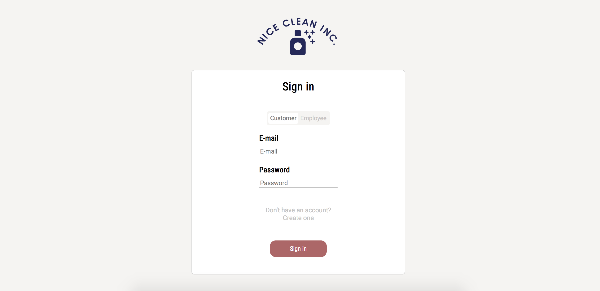

# Nice Clean Inc.
Cleaning business booking app where customers, employees and admin can sign in and manage bookings. ✨💦

## Installation
1. Clone the repo\
`git clone https://github.com/julialotta/MI-AgilaMetoder-StadaFintAB`

2. Install npm packages\
`npm install`

3. Create a .env\
To run this application you need the following two things in a .env file:\
CONNECTION_STRING=""\
JWTSECRET=""

4. Run Nodemon\
`nodemon`

5. Run Sass\
`npn run sass`

Visit localhost:8000 to view the project

## Built with
- HTML & SASS
- JavaScript
- Node.js
- Mongoose
- Express.js
- Handlebars

## Details
This was an agile development project built with Node.js.

Based on epics/user stories, the team developed a booking system with the goal of delivering a MVP focused on customer value. The team had a rotating scrum master schedule and worked with Jira to implement an agile sprint workflow.

Customers can sign in and book/cancel cleanings, employees can see their schedules and admin can perform administrative tasks.

## Contributors
[Julia-Lotta Tinglöf](https://github.com/julialotta)  
[Malin Nilsson](https://github.com/malin-nilsson)  
[Sofia Borg](https://github.com/sofiaborg)  
[Johanna Fryxell](https://github.com/johannafryxell)
